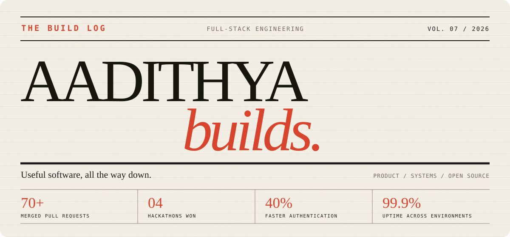
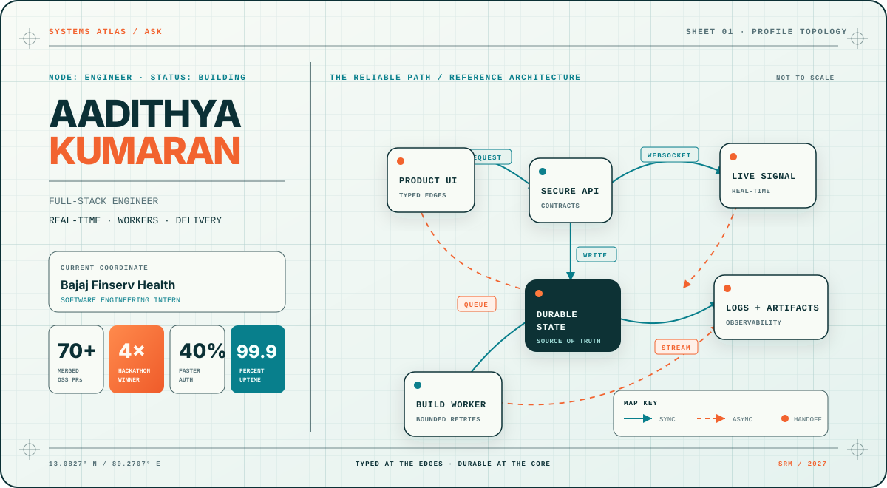

# Three directions. One profile.

### A visual review gallery for Aadithya Senthil Kumaran

Each option below is a complete, GitHub-compatible profile README—not an HTML mockup.
Open the concept to review the full composition, project story, links, and responsive assets.

 

---

## A · Signal Noir

**Cinematic · infrastructure-first · dark cyan/amber**

A high-contrast profile built around the feeling of a live system at night. Best when you want immediate visual impact and a strong platform-engineering identity.

---

## B · Build Log

**Editorial · personal · evidence-led**

A warm engineering journal with strong typography and projects treated like releases. Best when you want to feel thoughtful, distinctive, and more human than the usual developer profile.

---

## C · Systems Atlas

**Technical blueprint · architecture-led · teal/orange**

A profile drawn like a living system map, making your engineering thought process the visual centerpiece. Best when you want the most original and technically expressive direction.

---

### How to choose

Comment **A**, **B**, or **C** on [PR #2](https://github.com/aadithya2112/aadithya2112/pull/2)—or request a hybrid such as **A hero + C architecture + B project writing**.

The chosen direction will replace this gallery before the PR is merged.

