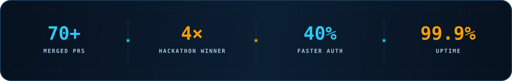
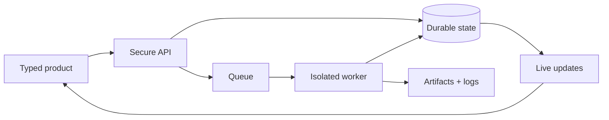

  

<h1 align="center">Aadithya Senthil Kumaran</h1>

  <strong>I build the path from an idea to a reliable system.</strong>

  

  
  
  
  

 

 

<table>
  <tr>
    <td width="58%" valign="top">
      <h3>What I care about</h3>
      

        I enjoy the engineering between <strong>“it works”</strong> and
        <strong>“it keeps working”</strong>: typed product surfaces, real-time data paths,
        background workers, secure APIs, deployment pipelines, and the observability
        that makes the whole thing understandable.
      

      

        My sweet spot is taking a product across boundaries—browser to API, queue to
        worker, database to live UI—and making every handoff deliberate.
      

    </td>
    <td width="42%" valign="top">
      <h3>Now</h3>
      
🩺 Software Engineering Intern at <strong>Bajaj Finserv Health</strong>

      
🎓 B.Tech CSE at <strong>SRM IST</strong> · graduating May 2027

      
🌱 Exploring worker systems, deployment infrastructure, and AI-assisted products

      
📍 Chennai / Bengaluru, India

    </td>
  </tr>
</table>

## Selected systems

<table>
  <tr>
    <td width="50%" valign="top">
      <h3>01 · Deploy Grid</h3>
      
A deployment platform that connects repositories, queues isolated builds, streams live logs, and stores artifacts in object storage.

      
<code>Next.js</code> <code>Bun</code> <code>Postgres</code> <code>Redis</code> <code>Cloudflare R2</code>

      
      
    </td>
    <td width="50%" valign="top">
      <h3>02 · LiveRooms</h3>
      
A real-time video conferencing system with a WebRTC media layer, a Node.js signaling service, containerized delivery, and automated CI/CD.

      
<code>React</code> <code>TypeScript</code> <code>WebRTC</code> <code>Socket.io</code> <code>Docker</code>

      
      
    </td>
  </tr>
  <tr>
    <td width="50%" valign="top">
      <h3>03 · Chatterly</h3>
      
An embeddable AI chat widget paired with a multi-tenant analytics dashboard and real-time WebSocket conversations.

      
<code>Next.js</code> <code>Bun</code> <code>Socket.io</code> <code>Prisma</code> <code>PostgreSQL</code>

      
    </td>
    <td width="50%" valign="top">
      <h3>04 · Worker Workflow Lab</h3>
      
An interactive lab comparing polling, long polling, SSE, and WebSockets over one durable BullMQ/PostgreSQL job model.

      
<code>React</code> <code>Bun</code> <code>BullMQ</code> <code>Redis</code> <code>PostgreSQL</code>

      
    </td>
  </tr>
</table>

## Toolbox

  

  
<strong>How I think about a production system</strong>

   

The details change. The habits do not: explicit contracts, durable state, bounded retries, useful logs, and a UI that tells the truth.

## Open-source trail

  I contributed across the <a href="https://github.com/PalisadoesFoundation">Palisadoes Foundation</a>
  ecosystem, including rootless Docker support, Redis cache warming, refactors, and integration-test coverage for Talawa.

<picture>
  <source media="(prefers-color-scheme: dark)" srcset="https://raw.githubusercontent.com/aadithya2112/aadithya2112/output/github-snake-dark.svg" />
  <source media="(prefers-color-scheme: light)" srcset="https://raw.githubusercontent.com/aadithya2112/aadithya2112/output/github-snake.svg" />
  
</picture>

 

  <samp>typed at the edges · durable at the core · observable all the way through</samp>

