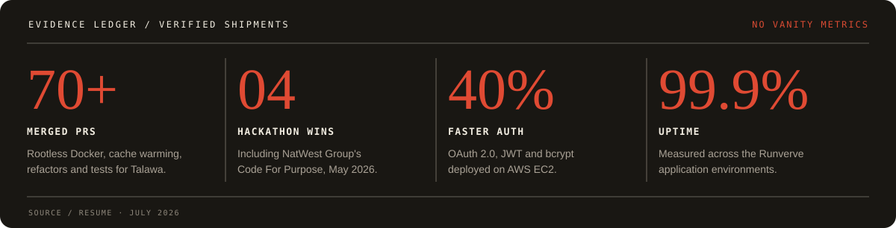

  

  
  
  
  

<samp>FULL-STACK ENGINEER &nbsp;/&nbsp; SYSTEMS BUILDER &nbsp;/&nbsp; OPEN-SOURCE CONTRIBUTOR</samp>

 

<table>
  <tr>
    <td width="64%" valign="top">
      THE LEAD
      <h2>Useful software, all the way down.</h2>
      

        I like owning the whole story: the interface people touch, the contract behind it,
        the queue carrying the work, the worker doing it, and the logs that explain what happened.
      

      

        My work sits where <strong>product craft</strong> meets <strong>reliable systems</strong> -
        especially real-time experiences, deployment infrastructure, secure APIs, and developer tooling.
      

    </td>
    <td width="36%" valign="top">
      FIELD NOTES / NOW
      <h3>Shipping in healthcare.</h3>
      
Software Engineering Intern <strong>Bajaj Finserv Health</strong>

      
B.Tech Computer Science <strong>SRM IST · May 2027</strong>

      
📍 Bengaluru / Chennai, India

    </td>
  </tr>
</table>

## 01 / Proof belongs near the promise

  

The performance and uptime results were delivered while engineering Runverve's authentication stack. Open-source results are from contributions to the Palisadoes Foundation's Talawa ecosystem.

## 02 / Release index

<table>
  <tr>
    <td width="12%" valign="top"><samp>REL-001</samp> DEPLOYMENT</td>
    <td width="54%" valign="top">
      <h3>Deploy Grid ↗</h3>
      
A full-stack deployment platform that connects repositories, triggers builds, and streams live deployment status and logs.

      
<strong>Inside the release:</strong> queue-backed orchestration, automated retries, isolated build workers, and object-storage artifacts.

    </td>
    <td width="34%" valign="top">
      <code>Next.js</code> <code>Bun</code> 
      <code>TypeScript</code> <code>Postgres</code> 
      <code>Redis</code> <code>Cloudflare R2</code>  
      <a href="https://deploy-grid.aadithya.dev">LIVE SYSTEM</a> · <a href="https://github.com/aadithya2112/deploy-grid">SOURCE</a>
    </td>
  </tr>
  <tr>
    <td width="12%" valign="top"><samp>REL-002</samp> REAL TIME</td>
    <td width="54%" valign="top">
      <h3>LiveRooms ↗</h3>
      
A real-time video conferencing application built around WebRTC, React, and TypeScript.

      
<strong>Inside the release:</strong> a Node.js signaling server, containerized services, and automated delivery through GitHub Actions.

    </td>
    <td width="34%" valign="top">
      <code>React</code> <code>TypeScript</code> 
      <code>Node.js</code> <code>WebRTC</code> 
      <code>Docker</code> <code>GitHub Actions</code>  
      <a href="https://rooms.aadithya.dev">JOIN A ROOM</a> · <a href="https://github.com/aadithya2112/LiveRooms">SOURCE</a>
    </td>
  </tr>
  <tr>
    <td width="12%" valign="top"><samp>REL-003</samp> OPEN SOURCE</td>
    <td width="54%" valign="top">
      <h3>Talawa engineering trail ↗</h3>
      
More than 70 merged pull requests across the Palisadoes Foundation ecosystem.

      
<strong>Inside the release:</strong> rootless Docker support, Redis cache warming, critical refactors, and broader unit and integration test coverage.

    </td>
    <td width="34%" valign="top">
      <code>Docker</code> <code>Redis</code> 
      <code>Testing</code> <code>Refactoring</code>  
      <a href="https://github.com/PalisadoesFoundation">FOUNDATION</a>
    </td>
  </tr>
</table>

## 03 / Notes from the field

> **The details change. The habits do not:** explicit contracts, durable state, bounded retries, useful logs, and a UI that tells the truth.

<table>
  <tr>
    <td width="50%" valign="top">
      WORK NOTE / HEALTHCARE
      <h3>Bajaj Finserv Health</h3>
      
Building frontend features for enterprise healthcare applications with React, Next.js, and TypeScript, while contributing to a shared design-system migration through Git and Azure DevOps.

    </td>
    <td width="50%" valign="top">
      WORK NOTE / PRODUCT
      <h3>Ignyt Labs</h3>
      
Built Clarity Board, a collaborative canvas with real-time synchronization and contextual AI assistance, plus ResumeAI for context-aware resume generation.

    </td>
  </tr>
  <tr>
    <td width="50%" valign="top">
      WORK NOTE / BACKEND
      <h3>Runverve</h3>
      
Architected a secure OAuth 2.0 and JWT authentication module on AWS EC2, then integrated Strava and three additional APIs for token-based fitness-data sync.

    </td>
    <td width="50%" valign="top">
      RECOGNITION / 2026
      <h3>Four-time hackathon winner</h3>
      
Including NatWest Group's Code For Purpose Hackathon, alongside Semicolon 10.0, Production 101, and Code Craft Chase.

    </td>
  </tr>
</table>

## 04 / Working set

  

  
<strong>Open the tool drawer</strong>

   

  **Languages** — Python, JavaScript, TypeScript, SQL 
  **Frameworks** — React, Next.js, Node.js, Express, FastAPI, Socket.io, Prisma, Tailwind CSS 
  **Data & messaging** — PostgreSQL, MongoDB, Redis, AWS SQS 
  **Cloud & delivery** — Docker, Linux, AWS, CI/CD, REST APIs, OAuth 2.0

  **Certifications** — MongoDB Associate Developer · AWS Cloud Practitioner · Red Hat Certified Specialist in Containers

 

  <samp>END OF LOG / START A CONVERSATION</samp>  
  <a href="https://aadithya.dev"><strong>aadithya.dev ↗</strong></a>

Built with deliberate interfaces, durable systems, and an unreasonable affection for useful logs.

