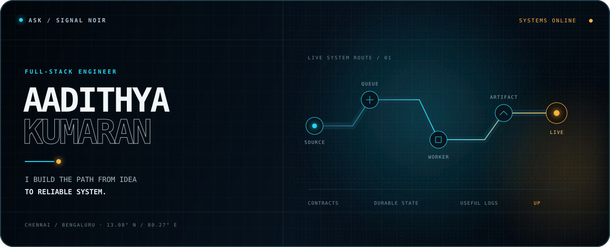
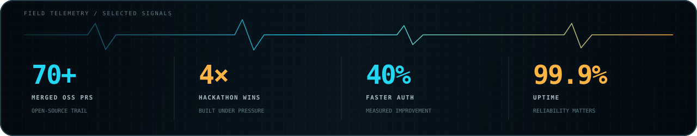
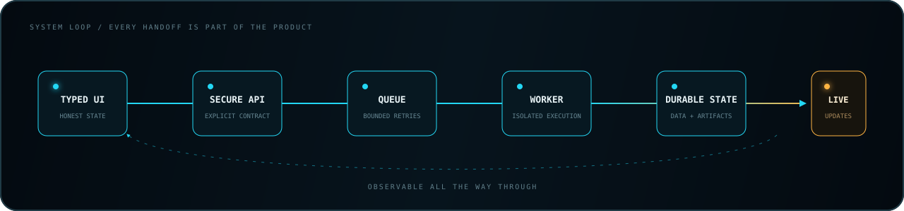

  

  &nbsp;
  &nbsp;
  &nbsp;
  

  <samp>typed at the edges&nbsp; · &nbsp;durable at the core&nbsp; · &nbsp;observable end to end</samp>

 

<table>
  <tr>
    <td width="58%" valign="top">
      <h3><code>01 / OPERATING RANGE</code></h3>
      

        I work in the distance between <strong>“it runs”</strong> and
        <strong>“it keeps running.”</strong> That means typed product surfaces, secure APIs,
        real-time data paths, queues, workers, deployment pipelines, and the telemetry
        that makes a system understandable.
      

      
My favorite work crosses boundaries—and makes every handoff deliberate.

    </td>
    <td width="42%" valign="top">
      <h3><code>CURRENT SIGNAL</code></h3>
      
🩺 Software Engineering Intern · <strong>Bajaj Finserv Health</strong>

      
🎓 B.Tech CSE · <strong>SRM IST</strong> · May 2027

      
📡 Exploring worker systems, deployment infrastructure, and AI-assisted products

      
📍 Chennai / Bengaluru, India

    </td>
  </tr>
</table>

 

## `02 / SELECTED TRANSMISSIONS`

<table>
  <tr>
    <td width="50%" valign="top">
      <code>DEPLOYMENT INFRASTRUCTURE / 01</code>
      <h3>Deploy Grid</h3>
      
Repository in. Isolated build out. A queue-backed deployment platform that streams live logs and stores artifacts in object storage.

      
<code>Next.js</code> <code>Bun</code> <code>Postgres</code> <code>Redis</code> <code>Cloudflare R2</code>

      

        
        
      

    </td>
    <td width="50%" valign="top">
      <code>REAL-TIME COMMUNICATION / 02</code>
      <h3>LiveRooms</h3>
      
A video-conferencing system with a WebRTC media layer, a dedicated signaling service, containerized delivery, and automated CI/CD.

      
<code>React</code> <code>TypeScript</code> <code>WebRTC</code> <code>Socket.io</code> <code>Docker</code>

      

        
        
      

    </td>
  </tr>
  <tr>
    <td width="50%" valign="top">
      <code>EMBEDDED AI / 03</code>
      <h3>Chatterly</h3>
      
An embeddable AI chat surface paired with a multi-tenant analytics dashboard and real-time WebSocket conversations.

      
<code>Next.js</code> <code>Bun</code> <code>Socket.io</code> <code>Prisma</code> <code>PostgreSQL</code>

      

    </td>
    <td width="50%" valign="top">
      <code>ASYNC SYSTEMS / 04</code>
      <h3>Worker Workflow Lab</h3>
      
An interactive lab comparing polling, long polling, SSE, and WebSockets over one durable BullMQ/PostgreSQL job model.

      
<code>React</code> <code>Bun</code> <code>BullMQ</code> <code>Redis</code> <code>PostgreSQL</code>

      

    </td>
  </tr>
</table>

## `03 / SYSTEM PHILOSOPHY`

  
<strong>Read the field notes</strong>

   
  

    The technologies change; the habits do not: explicit contracts, durable state,
    bounded retries, useful logs, and interfaces that tell the truth. I like systems
    where the failure paths are designed with the same care as the happy path.
  

## `04 / TOOLCHAIN`

  
   
  

## `05 / OPEN-SOURCE TRAIL`

I have contributed across the [Palisadoes Foundation](https://github.com/PalisadoesFoundation) ecosystem, including rootless Docker support, Redis cache warming, refactors, and integration-test coverage for Talawa.

<picture>
  <source media="(prefers-color-scheme: dark)" srcset="https://raw.githubusercontent.com/aadithya2112/aadithya2112/output/github-snake-dark.svg" />
  <source media="(prefers-color-scheme: light)" srcset="https://raw.githubusercontent.com/aadithya2112/aadithya2112/output/github-snake.svg" />
  
</picture>

 

  <samp>OPEN CHANNEL</samp>  
  <a href="https://aadithya.dev"><strong>aadithya.dev ↗</strong></a>

built for systems that keep their promises

